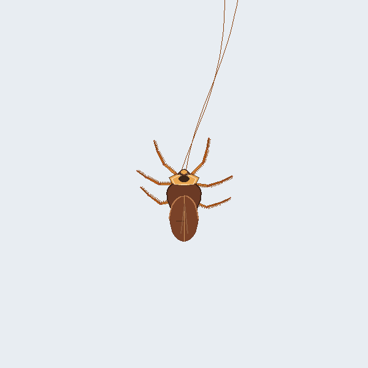
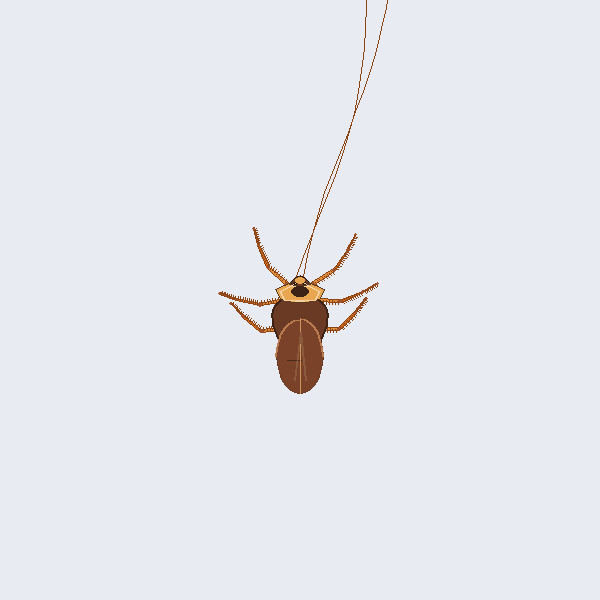
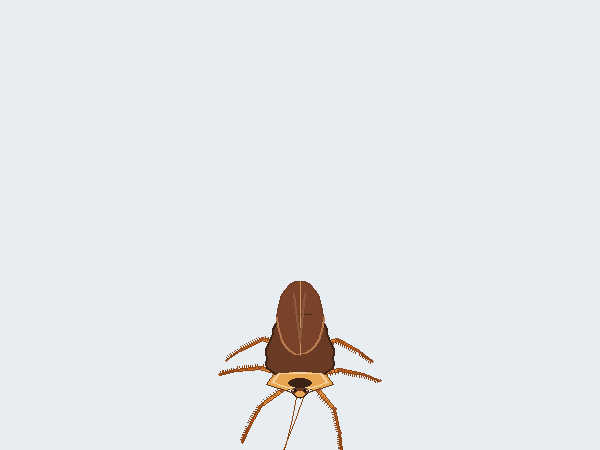

# 🪳 电子桌宠蟑螂 · CockroachPet

> 一只会爬、会怕你、能被抓起来甩飞的桌面宠物蟑螂 🪳

用 Python 原生 **tkinter** 绘制，无需任何游戏引擎，纯标准库 + 两个小依赖。

> 🪟 **仅支持 Windows**（透明窗口与开机自启依赖 Windows 特性）　·　🐍 需要 **Python 3.8+**（推荐 3.10+）



## ✨ 特性

- 🚶 **漫游**：在桌面上随机乱爬
- 🧲 **吸引**：鼠标慢慢靠近，它会被你吸引
- 😱 **惊吓**：鼠标快速甩向它，它会惊恐逃跑
- ✋ **抓取**：长按 0.35 秒抓起，甩手扔飞
- 🖱️ **右键菜单**：设置 / 重置位置 / 退出
- 🪟 **系统托盘**：显示/隐藏、设置、退出
- ⚙️ **配置热重载**：改 `config.json` 立即生效，无需重启

## 🎬 效果演示





## 🚀 快速开始

### 运行源码

> ⚠️ 请使用 **Windows** 与 **Python 3.8+**（推荐 3.10+）。

```bash
pip install -r requirements.txt
python src/main.py
```

### 打包成 exe

```bash
pyinstaller CockroachPet.spec
# 产物输出到 dist/ 目录
```

## 📂 目录结构

```text
.
├── src/                    # 全部源码
│   ├── main.py             # 入口与窗口
│   ├── pet.py              # 顶层门面（整合逻辑）
│   ├── renderer.py         # 画布绘制
│   ├── physics_engine.py   # 向量与物理
│   ├── behavior_engine.py  # 行为状态机
│   ├── cockroach_model.py  # 几何模型
│   ├── config_manager.py   # 配置数据层
│   ├── settings_ui.py      # 设置界面
│   ├── autostart.py        # 开机自启
│   └── previews/           # 开发预览脚本
├── assets/                 # 演示素材（README 使用）
├── config.json             # 运行配置（可调参数）
├── CockroachPet.spec       # PyInstaller 打包配置
├── requirements.txt        # 依赖清单
├── LEARNING_GUIDE.md       # 📖 白痴级源码教学
├── build/ · dist/          # 打包产物（自动生成）
└── archive/                # 历史版本构建产物存档
```

## 📖 文档

- [**LEARNING_GUIDE.md**](LEARNING_GUIDE.md) —— 从零讲透每一行代码的教学文档，适合 Python 初学者

## 🛠️ 常见问题（Troubleshooting）

**Q：运行报错 `ModuleNotFoundError: No module named 'pystray'`？**
A：依赖没装全，在项目根目录执行 `pip install -r requirements.txt`。

**Q：蟑螂周围出现洋红色 / 不透明背景？**
A：透明背景依赖 Windows 的透明色特性（Win10/11 正常）。若异常，请确认没有运行在其他系统或远程桌面环境下。

**Q：系统托盘图标不显示？**
A：确认 `pystray` 已安装；若仍不显示，重启资源管理器（任务管理器 → Windows 资源管理器 → 重新启动）。

**Q：开机自启没生效？**
A：部分杀毒软件会拦截注册表写入（`HKCU\Software\Microsoft\Windows\CurrentVersion\Run`），放行 `CockroachPet` 即可；可在设置界面关闭/开启后验证。

**Q：双击 `main.py` 闪退？**
A：Windows 下双击 `.py` 会用控制台运行且不保留报错窗口。请用命令 `python src/main.py` 运行，或直接使用打包好的 exe。

**Q：能用 macOS / Linux 吗？**
A：目前**不支持**。透明窗口（`-transparentcolor`）与开机自启（`winreg`）都是 Windows 专属特性。

## 📜 许可

[MIT](LICENSE)
